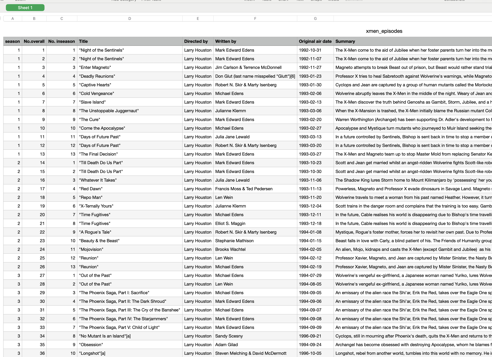

# X-MEN Data Analysis
A data analysis using Google Cloud services like Dataform, Cloud Storage, BigQuery and Looker Studio.


## The Process

Extract data about episodes using the wikipedia tables in this URL: https://en.wikipedia.org/wiki/List_of_X-Men:_The_Animated_Series_episodes. The Python script uses web scraping to obtain information about these columns:
- No. overall	
- No. in season
- Title
- Directed by
- Written by
- Original air date
- Summary

In other words, extract info from awful and fanciful tables like this:


To this:



## Git setup

### Installing git

```
sudo apt install git -y
```

### Configure git

Execute the following command (replace with your email)
```
ssh-keygen -t ed25519 -C "your_email@example.com"
git config --global user.email "your_email@example.com"
git config --global user.name "Your Name"
```

Then, execute:

```
cat /home/REPLACE_WITH_YOUR_USER/.ssh/id_ed25519.pub
```

Copy that line and paste it into your github account (go to https://github.com/settings/keys)

### Clone the repo

```
git clone [REPLACE_WITH_THE_REPO_URL]
```

## Python Setup

### Installing Python PIP

```
sudo apt install python3-pip
```

### Installing virtual environment

```
sudo apt install python3-virtualenv -y
sudo apt install python3.11-venv
```

### Creating a virtual environment `env`

```
python3 -m venv env
```

### Activating virtual environment `env`

```
source env/bin/activate
```

### A word about specifying dependencies

1. Create a *requirements.in* with the libraries you need to install.
2. Install `pip-tools`. Run this command `python -m pip install pip-tools`
3. Generate the *requirements.txt* file by running this command `pip-compile requirements.in`


### Installing Python libraries

```
pip install -r requirements.txt
```

## Operations

### Running

Execute the following command:

```
python xmen_scraper.py
```
