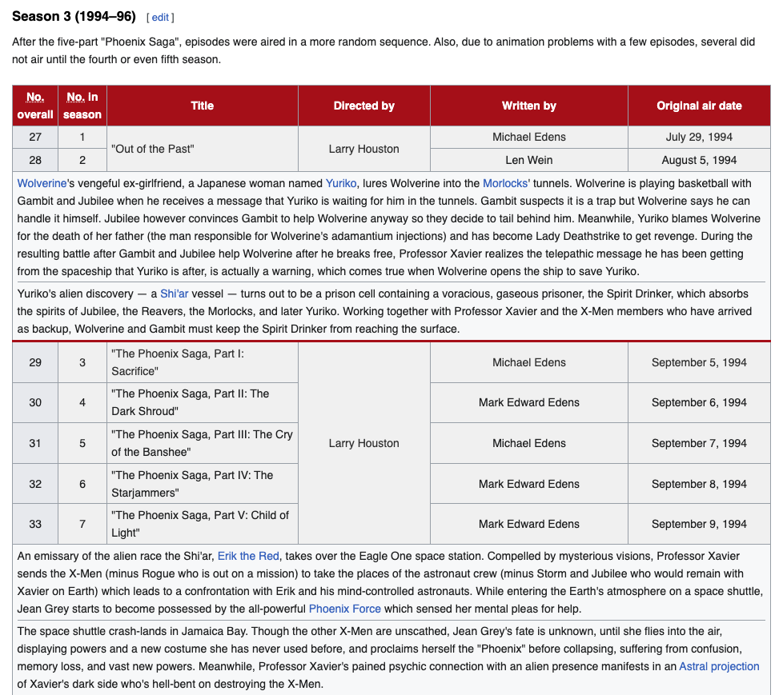

# X-MEN Data Analysis
A data analysis using Google Cloud services like Dataform, Cloud Storage, BigQuery and Looker Studio.


## The Process

Extract data about episodes using the wikipedia tables in this URL: https://en.wikipedia.org/wiki/List_of_X-Men:_The_Animated_Series_episodes. The Python script uses web scraping to obtain information about these columns:
- No. overall	
- No. in season
- Title
- Directed by
- Written by
- Original air date
- Summary

In other words, extract info from awful and fanciful tables like this:



To this:


## Git setup

### Installing git

```
sudo apt install git -y
```

### Configure git

Execute the following command (replace with your email)
```
ssh-keygen -t ed25519 -C "your_email@example.com"
git config --global user.email "your_email@example.com"
git config --global user.name "Your Name"
```

Then, execute:

```
cat /home/REPLACE_WITH_YOUR_USER/.ssh/id_ed25519.pub
```

Copy that line and paste it into your github account (go to https://github.com/settings/keys)

### Clone the repo

```
git clone [REPLACE_WITH_THE_REPO_URL]
```

## Python Setup

### Installing Python PIP

```
sudo apt install python3-pip
```

### Installing virtual environment

```
sudo apt install python3-virtualenv -y
sudo apt install python3.11-venv
```

### Creating a virtual environment `env`

```
python3 -m venv env
```

### Activating virtual environment `env`

```
source env/bin/activate
```

### A word about specifying dependencies

1. Create a *requirements.in* with the libraries you need to install.
2. Install `pip-tools`. Run this command `python -m pip install pip-tools`
3. Generate the *requirements.txt* file by running this command `pip-compile requirements.in`


### Installing Python libraries

```
pip install -r requirements.txt
```

## Operations

### Running

Execute the following command:

```
python xmen_scraper.py
```

## Further work

### What analysis can I apply to the final dataset of episode data?

There are several interesting analyses you can apply to the X-Men: The Animated Series episode dataset. Here are some suggestions:

1. Episode distribution:

- Count the number of episodes per season
- Analyze the frequency of multi-part episodes

2. Time analysis:

- Plot the air dates to visualize the show's timeline
- Calculate the average time between episodes
- Identify any significant gaps or breaks in airing

3. Director and writer analysis:

- Count the number of episodes per director and writer
- Identify the most prolific directors and writers
- Analyze if certain writers/directors tend to work on specific types of episodes (e.g., season openers, finales)

4. Title analysis:

- Perform text analysis on episode titles (e.g., word frequency, common themes)
- Check if there are any naming patterns across seasons

5. Character focus:

- If possible, analyze which characters are featured prominently in each episode
- Track character introductions and development across the series

6. Seasonal patterns:

- Compare characteristics of episodes across different seasons (e.g., episode length, themes)
- Identify any trends or changes in the show's format over time

7. Ratings and reception (if data is available):

- Analyze viewer ratings or critical reception of episodes
- Identify the highest and lowest-rated episodes
- Look for correlations between ratings and other factors (writer, director, air date, etc.)

8. Theme or plot analysis:

- Categorize episodes by main themes or plot types
- Analyze the distribution of different themes across seasons

9. Guest characters or villains:

- Track the introduction and recurrence of important guest characters or villains

10. Production timeline:

- If production dates are available, analyze the time between production and air date

To perform these analyses, you might want to use Python libraries such as:

- pandas for data manipulation
- matplotlib or seaborn for data visualization
- nltk for natural language processing (for title analysis)
- scikit-learn for any machine learning tasks (e.g., clustering episodes by theme)
